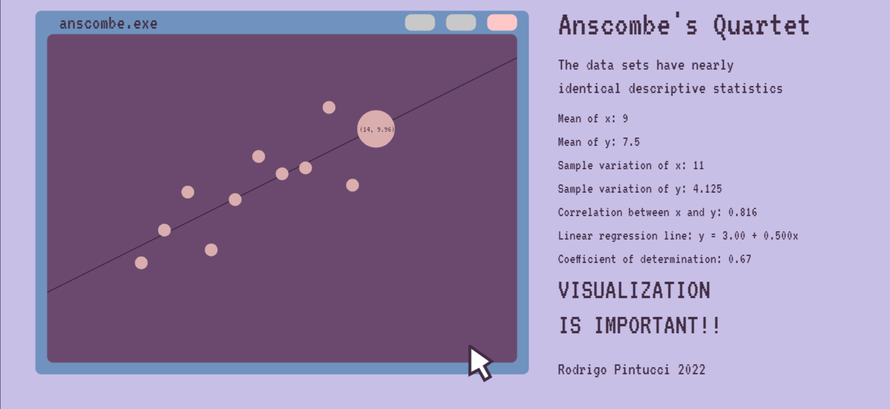
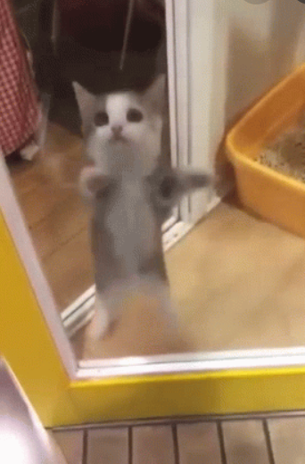

# Visualização da Informação
## Hello viz
#### Professora: Asla Medeiros e Sá
#### Aluno: Rodrigo Gomes Hutz Pintucci
#### 2022

A proposta do trabalho era fazer uma visualização do quarteto de Anscombe utilizando uma programação de interesse. Devido à matéria de Introdução a Computação Gráfica, lecionada pela professora Asla Medeiros de Sá, optei por prosseguir utilizando o Canvas do HTML5.
Dessa forma, o trabalho consiste de um arquivo curto de HTML, que contém o código para a criação da janela Canvas, e um arquivo de JavaScript, que contém o código para a manipulação dos dados e a criação da visualização.

```html
<!DOCTYPE html>
<html lang="en">
<head>
    <meta charset="UTF-8">
    <meta http-equiv="X-UA-Compatible" content="IE=edge">
    <meta name="viewport" content="width=device-width, initial-scale=1.0">
    <link rel="icon" href="https://rodrigopintucci.github.io/Tabby/tabbyena3.png">
    <title>Anscombe's Quartet</title>
    <style type="text/css">
        canvas{
            border: 1px solid rgb(64, 44, 66);
            background: rgb(200, 191, 231);
        }
        body{
            margin: 0;
        }
    </style>
</head>
<body>
    <canvas></canvas>
    <script src="canvas.js"></script>
</body>
</html>
```
Neste código em HTML, temos a criação da janela Canvas, que é a área onde a visualização será exibida. Além disso, temos a importação do arquivo JavaScript e a escolha de algumas particularidades da página, como o favicon e o título. Uma pequena seção de CSS é utilizada para definir a cor de fundo e a borda da janela Canvas.

```javascript
var canvas = document.querySelector('canvas');
canvas.width = window.innerWidth
canvas.height = window.innerHeight

var c = canvas.getContext('2d');

WebFontConfig = {
    google: { families: ['VT323'] }
}

var wf = document.createElement("script");
wf.src = 'https://ajax.googleapis.com/ajax/libs/webfont/1/webfont.js';
wf.async = 'true';
document.head.appendChild(wf);

// mouse object
var mouse = {
    // coordinates
    x: undefined,
    y: undefined,
    // quartet phase
    q: 1
}

// interaction with mouse hover
window.addEventListener('mousemove', function(event){
    mouse.x = event.x;
    mouse.y = event.y;
})

// interaction with mouse click
window.addEventListener('click', whenclick);

// window resize
window.addEventListener('resize', function(){
    canvas.width = window.innerWidth;
    canvas.height = window.innerHeight;
    // initialize again
    init();
})

// text object
function Texto(x, y, text, size, color){
    // atributes
    this.x = x;
    this.y = y;
    this.text = text;
    this.size = size;
    this.color = color;
    // draw function
    this.draw = function(){
        c.beginPath();
        c.font = this.size + "px VT323";
        c.fillStyle = this.color; // remove this line to see the difference
        c.textBaseline = "alphabetic";
        c.textAlign = "start";
        c.fillText(this.text, this.x, this.y);
        c.stroke();
    }
    //update function
    this.update = function(){
        this.draw();
    }
}

// rectangle object
function Square(x, y, width, lenght, color){
    // atributes
    this.x = x;
    this.y = y;
    this.width = width;
    this.lenght = lenght;
    this.color = color;
    // draw function
    this.draw = function(){
        c.beginPath();
        //c.rect(this.x, this.y, this.width, this.lenght);
        c.roundRect(this.x, this.y, this.width, this.lenght, 10);
        c.strokeStyle = this.color;
        c.lineWidth = 1;
        c.stroke();
        c.fillStyle = this.color;
        c.fill();
    }
    // update function
    this.update = function(){
        this.draw();
    }

}

// circle object
function Circle(x, y, dx, dy, radius, i, r, g, b, maxRadius, minRadius) {
    // atributes
    this.x = x;
    this.y = y;
    this.dx = dx;
    this.dy = dy;
    this.radius = radius;
    this.i = i; // index
    this.r = r;
    this.g = g;
    this.b = b;
    this.maxRadius = maxRadius;
    this.minRadius = minRadius;
    // draw function
    this.draw = function() {
        c.beginPath();
        c.arc(this.x, this.y, this.radius, 0, Math.PI*2, true);
        c.strokeStyle = "rgb(" + this.r + "," + this.g + "," + this.b + ")";
        c.fillStyle = "rgb(" + this.r + "," + this.g + "," + this.b + ")";
        c.stroke();
        c.fill();
    }
    // update function
    this.update = function() {
        for (var i = 0; i < circleArray.length; i++){
            // checks the phase
            var rgb_i = [this.r, this.g, this.b];
            if (mouse.q == 1){
                var initial = [fourthX[i], fourthY[i]];
                var final = [firstX[i], firstY[i]];
                var rgb_f = [rgb1[0], rgb1[1], rgb1[2]];
            } else if (mouse.q == 2){     
                var initial = [firstX[i], firstY[i]];
                var final = [firstX[i], secondY[i]];
                var rgb_f = [rgb2[0], rgb2[1], rgb2[2]];
            } else if (mouse.q == 3){
                var initial = [firstX[i], secondY[i]];
                var final = [firstX[i], thirdY[i]];
                var rgb_f = [rgb3[0], rgb3[1], rgb3[2]];
            } else if (mouse.q == 4){
                var initial = [firstX[i], thirdY[i]];
                var final = [fourthX[i], fourthY[i]];
                var rgb_f = [rgb4[0], rgb4[1], rgb4[2]];
            }
            // checks the order
            if (this.i == i){
                // fixes the x position
                if (final[0] > initial[0]){
                    if (this.x < (final[0] + 2)*40){
                        this.x += this.dx * final[0]/initial[0];
                    }
                } else {
                    if (this.x > (final[0] + 2)*40){
                        this.x -= this.dx * initial[0]/final[0];
                    }
                }
                // fixes the y position
                if (final[1] > initial[1]){
                    if (this.y > canvas.height - 100 - final[1]*40){
                        this.y -= this.dy * final[1]/initial[1];
                    }
                } else {
                    if (this.y < canvas.height - 100 - final[1]*40){
                        this.y += this.dy * initial[1]/final[1];
                    }
                }
                // fixes the color
                for (var k = 0; k < 3; k++){
                    if (rgb_i[k] < rgb_f[k]){
                        rgb_i[k] += 1;
                    } else {
                        rgb_i[k] -= 1;
                    }
                }
                this.r = rgb_i[0];
                this.g = rgb_i[1];
                this.b = rgb_i[2];
            }
        }
        // hover interaction
        if (mouse.x - this.x < 20 && mouse.x - this.x > -20 && mouse.y - this.y < 20 && mouse.y - this.y > -20){
                if (this.radius < this.maxRadius){
                    this.radius += 3;
                }
        } else if (this.radius > this.minRadius) {
            this.radius -= 1;
        }
        this.draw();

        // prints the coordinates while hovering
        if (this.radius >= this.maxRadius){
            var x = firstX[this.i];
            if (mouse.q == 1){
                var y = firstY[this.i];
            } else if (mouse.q == 2){
                var y = secondY[this.i];
            } else if (mouse.q == 3){
                var y = thirdY[this.i];
            } else if (mouse.q == 4){
                var x = fourthX[this.i];
                var y = fourthY[this.i];
            }
            c.beginPath();
            c.font = "15px VT323";
            c.fillStyle = "rgb(64, 44, 66)";
            //c.fillText("(X, Y)", this.x - this.radius + 2, this.y + this.radius/5);
            c.textBaseline = "middle";
            c.textAlign = "center";
            c.fillText("(" + x + ", " + y + ")", this.x  + 2, this.y);
            c.stroke();
        }
    }

}

// click interaction
function whenclick (){
    if (mouse.q < 4){
        mouse.q += 1;
    } else {
        mouse.q = 1;
    }
}

// array to store the dots
var circleArray = [];

// creates the objects
function init(){
    // anscombe coordinates
    firstX = [10, 8, 13, 9, 11, 14, 6, 4, 12, 7, 5];
    firstY = [8.04, 6.95, 7.58, 8.81, 8.33, 9.96, 7.24, 4.26, 10.84, 4.82, 5.68];
    secondY = [9.14, 8.14, 8.74, 8.77, 9.26, 8.10, 6.13, 3.10, 9.13, 7.26, 4.74];
    thirdY = [7.46, 6.77, 12.74, 7.11, 7.81, 8.84, 6.08, 5.39, 8.15, 6.42, 5.73];
    fourthX = [8, 8, 8, 8, 8, 8, 8, 19, 8, 8, 8];
    fourthY = [6.58, 5.76, 7.71, 8.84, 8.47, 7.04, 5.25, 12.50, 5.56, 7.91, 6.89];
    // colors
    rgb1 = [219, 175, 175];
    rgb2 = [219, 209, 173];
    rgb3 = [173, 219, 186];
    rgb4 = [173, 177, 219];
    // creates the rectangles
    sq1 = new Square((1.5)*40, canvas.height - 140 - 14*40, 21*40, (3.15 +10.84 + 1.5)*40, 'rgb(112, 146, 190)')
    sq2 = new Square((2)*40, canvas.height - 100 - 14*40, 20*40, (3.15 +10.84)*40, 'rgb(107, 73, 110)');
    button1 = new Square(690, canvas.height - 134 - 14 *40, 50, 27, 'rgb(200, 200, 200)');
    button2 = new Square(760, canvas.height - 134 - 14 *40, 50, 27, 'rgb(200, 200, 200)');
    button3 = new Square(830, canvas.height - 134 - 14 *40, 50, 27, 'rgb(255, 200, 200)');
    squares = [sq1, sq2, button1, button2, button3];
    // creates the dots
    circleArray = [];
    for(var i = 0; i < 11; i++){
        var radius = 10;
        var x = (firstX[i] + 2)*40;
        var y = canvas.height - 100 - firstY[i]*40;
        var dx = 1;
        var dy = 1;
        var i = i;
        var r = 219;
        var g = 175;
        var b = 175;
        var maxRadius = 3*radius;
        var minRadius = 1*radius;
        circleArray.push(new Circle(x, y, dx, dy, radius, i, r, g, b, maxRadius, minRadius));
    }
    // creates the texts
    texts = [];
    txt = new Texto(100, canvas.height - 110 - 14*40, "anscombe.exe", 35, 'rgb(64, 44, 66)');
    title = new Texto(950, canvas.height - 110 - 14*40 + 10, "Anscombe's Quartet", 60, 'rgb(64, 44, 66)');
    subtitle = new Texto(950, canvas.height - 110 - 14*40 + 70, "The data sets have nearly" , 30, 'rgb(64, 44, 66)');
    subtitle2 = new Texto(950, canvas.height - 110 - 14*40 + 110, "identical descriptive statistics" , 30, 'rgb(64, 44, 66)');
    example1 = new Texto(950, canvas.height - 110 - 14*40 + 160, "Mean of x: 9", 25, 'rgb(64, 44, 66)');
    example2 = new Texto(950, canvas.height - 110 - 14*40 + 200, "Mean of y: 7.5", 25, 'rgb(64, 44, 66)');
    example3 = new Texto(950, canvas.height - 110 - 14*40 + 240, "Sample variation of x: 11", 25, 'rgb(64, 44, 66)');
    example4 = new Texto(950, canvas.height - 110 - 14*40 + 280, "Sample variation of y: 4.125", 25, 'rgb(64, 44, 66)');
    example5 = new Texto(950, canvas.height - 110 - 14*40 + 320, "Correlation between x and y: 0.816", 25, 'rgb(64, 44, 66)');
    example6 = new Texto(950, canvas.height - 110 - 14*40 + 360, "Linear regression line: y = 3.00 + 0.500x", 25, 'rgb(64, 44, 66)');
    example7 = new Texto(950, canvas.height - 110 - 14*40 + 400, "Coefficient of determination: 0.67", 25, 'rgb(64, 44, 66)');
    tldr = new Texto(950, canvas.height - 110 - 14*40 + 460, "VISUALIZATION", 50, 'rgb(64, 44, 66)');
    tldr2 = new Texto(950, canvas.height - 110 - 14*40 + 520, "IS IMPORTANT!!" , 50, 'rgb(64, 44, 66)');
    credits = new Texto(950, canvas.height - 110 - 14*40 + 590, "Rodrigo Pintucci 2022", 30, 'rgb(64, 44, 66)');
    texts = [txt, title, subtitle, subtitle2, example1, example2, example3, example4, example5, example6, example7, tldr, tldr2, credits];
}

// animation loop
function animate() {
    requestAnimationFrame(animate);
    c.clearRect(0, 0, innerWidth, innerHeight);
    for (var i = 0; i < squares.length; i++){
        squares[i].update();
    }
    // draw the regression line
    c.beginPath();
    c.moveTo(0 + 80, canvas.height - 300 + 300 - 7*40 + 60);
    c.lineWidth = 2;
    c.lineTo(800 + 80, canvas.height - 700 + 280 - 5*40);
    c.strokeStyle = 'rgb(64, 44, 66)';
    c.stroke();

    // helpful lines    
    // c.beginPath();
    // c.moveTo(0 + 80 +14*40, canvas.height - 300 + 300 - 4*40); 
    // c.lineTo(0 + 80 +14*40, canvas.height - 1000 + 300 - 4*40);
    // c.strokeStyle = 'rgb(0, 0, 0)';
    // c.stroke();
    // c.beginPath();
    // c.moveTo(0 + 80, canvas.height - 300 + 300 - 7*40 + 60);
    // c.lineTo(1400 + 80, canvas.height - 300 + 300 - 7*40 + 60);
    // c.strokeStyle = 'rgb(0, 0, 0)';
    // c.stroke();
    // c.beginPath();
    // c.moveTo(0 + 80, canvas.height - 300 + 300 - 14*40 + 60);
    // c.lineTo(1400 + 80, canvas.height - 300 + 300 - 14*40 + 60);
    // c.strokeStyle = 'rgb(0, 0, 0)';
    // c.stroke();

    for (var i = 0; i < circleArray.length; i++){
        circleArray[i].update();
    }
    for (var i = 0; i < texts.length; i++){
        texts[i].update();
    }

    // mouse drawing
    c.beginPath();
    c.moveTo(800, canvas.height - 130);
    c.lineWidth = 5;
    c.lineTo( 800, canvas.height - 130 + 50);
    c.lineTo( 815, canvas.height - 130 + 42);
    c.lineTo( 825, canvas.height - 130 + 60);
    c.lineTo( 835, canvas.height - 130 + 54);
    c.lineTo( 825, canvas.height - 130 + 36);
    c.lineTo( 837, canvas.height - 130 + 28);
    c.lineTo( 801, canvas.height - 127.5);
    c.strokeStyle = 'rgb(64, 44, 66)';
    c.fillStyle = 'rgb(255, 255, 255)';
    c.fill();
    c.stroke();
}
init();
animate();
```

A complexidade toda está, como podemos ver, no código em Javascript. Vamos separá-lo em partes para entendermos melhor o que está acontecendo.

```javascript
var canvas = document.querySelector('canvas');
canvas.width = window.innerWidth
canvas.height = window.innerHeight

var c = canvas.getContext('2d');

WebFontConfig = {
    google: { families: ['VT323'] }
}

var wf = document.createElement("script");
wf.src = 'https://ajax.googleapis.com/ajax/libs/webfont/1/webfont.js';
wf.async = 'true';
document.head.appendChild(wf);

// mouse object
var mouse = {
    // coordinates
    x: undefined,
    y: undefined,
    // quartet phase
    q: 1
}

// interaction with mouse hover
window.addEventListener('mousemove', function(event){
    mouse.x = event.x;
    mouse.y = event.y;
})

// interaction with mouse click
window.addEventListener('click', whenclick);

// window resize
window.addEventListener('resize', function(){
    canvas.width = window.innerWidth;
    canvas.height = window.innerHeight;
    // initialize again
    init();
})
```
Aqui, determinamos o tamanho do Canvas, o contexto 2D e carregamos a fonte que usaremos. Também definimos o objeto mouse, que será usado para interagir com o usuário. Por fim, definimos os eventos de interação com o mouse e o redimensionamento da janela.

```javascript
// text object
function Texto(x, y, text, size, color){
    // atributes
    this.x = x;
    this.y = y;
    this.text = text;
    this.size = size;
    this.color = color;
    // draw function
    this.draw = function(){
        c.beginPath();
        c.font = this.size + "px VT323";
        c.fillStyle = this.color; // remove this line to see the difference
        c.textBaseline = "alphabetic";
        c.textAlign = "start";
        c.fillText(this.text, this.x, this.y);
        c.stroke();
    }
    //update function
    this.update = function(){
        this.draw();
    }
}

// rectangle object
function Square(x, y, width, lenght, color){
    // atributes
    this.x = x;
    this.y = y;
    this.width = width;
    this.lenght = lenght;
    this.color = color;
    // draw function
    this.draw = function(){
        c.beginPath();
        //c.rect(this.x, this.y, this.width, this.lenght);
        c.roundRect(this.x, this.y, this.width, this.lenght, 10);
        c.strokeStyle = this.color;
        c.lineWidth = 1;
        c.stroke();
        c.fillStyle = this.color;
        c.fill();
    }
    // update function
    this.update = function(){
        this.draw();
    }

}
```
Aqui, definimos os objetos Texto e Square. O primeiro é usado para escrever o texto na tela, enquanto o segundo é usado para desenhar os retângulos que formam o gráfico, que tomam a forma de uma janela de computador.

```javascript
// circle object
function Circle(x, y, dx, dy, radius, i, r, g, b, maxRadius, minRadius) {
    // atributes
    this.x = x;
    this.y = y;
    this.dx = dx;
    this.dy = dy;
    this.radius = radius;
    this.i = i; // index
    this.r = r;
    this.g = g;
    this.b = b;
    this.maxRadius = maxRadius;
    this.minRadius = minRadius;
    // draw function
    this.draw = function() {
        c.beginPath();
        c.arc(this.x, this.y, this.radius, 0, Math.PI*2, true);
        c.strokeStyle = "rgb(" + this.r + "," + this.g + "," + this.b + ")";
        c.fillStyle = "rgb(" + this.r + "," + this.g + "," + this.b + ")";
        c.stroke();
        c.fill();
    }
    // update function
    this.update = function() {
        for (var i = 0; i < circleArray.length; i++){
            // checks the phase
            var rgb_i = [this.r, this.g, this.b];
            if (mouse.q == 1){
                var initial = [fourthX[i], fourthY[i]];
                var final = [firstX[i], firstY[i]];
                var rgb_f = [rgb1[0], rgb1[1], rgb1[2]];
            } else if (mouse.q == 2){     
                var initial = [firstX[i], firstY[i]];
                var final = [firstX[i], secondY[i]];
                var rgb_f = [rgb2[0], rgb2[1], rgb2[2]];
            } else if (mouse.q == 3){
                var initial = [firstX[i], secondY[i]];
                var final = [firstX[i], thirdY[i]];
                var rgb_f = [rgb3[0], rgb3[1], rgb3[2]];
            } else if (mouse.q == 4){
                var initial = [firstX[i], thirdY[i]];
                var final = [fourthX[i], fourthY[i]];
                var rgb_f = [rgb4[0], rgb4[1], rgb4[2]];
            }
            // checks the order
            if (this.i == i){
                // fixes the x position
                if (final[0] > initial[0]){
                    if (this.x < (final[0] + 2)*40){
                        this.x += this.dx * final[0]/initial[0];
                    }
                } else {
                    if (this.x > (final[0] + 2)*40){
                        this.x -= this.dx * initial[0]/final[0];
                    }
                }
                // fixes the y position
                if (final[1] > initial[1]){
                    if (this.y > canvas.height - 100 - final[1]*40){
                        this.y -= this.dy * final[1]/initial[1];
                    }
                } else {
                    if (this.y < canvas.height - 100 - final[1]*40){
                        this.y += this.dy * initial[1]/final[1];
                    }
                }
                // fixes the color
                for (var k = 0; k < 3; k++){
                    if (rgb_i[k] < rgb_f[k]){
                        rgb_i[k] += 1;
                    } else {
                        rgb_i[k] -= 1;
                    }
                }
                this.r = rgb_i[0];
                this.g = rgb_i[1];
                this.b = rgb_i[2];
            }
        }
        // hover interaction
        if (mouse.x - this.x < 20 && mouse.x - this.x > -20 && mouse.y - this.y < 20 && mouse.y - this.y > -20){
                if (this.radius < this.maxRadius){
                    this.radius += 3;
                }
        } else if (this.radius > this.minRadius) {
            this.radius -= 1;
        }
        this.draw();

        // prints the coordinates while hovering
        if (this.radius >= this.maxRadius){
            var x = firstX[this.i];
            if (mouse.q == 1){
                var y = firstY[this.i];
            } else if (mouse.q == 2){
                var y = secondY[this.i];
            } else if (mouse.q == 3){
                var y = thirdY[this.i];
            } else if (mouse.q == 4){
                var x = fourthX[this.i];
                var y = fourthY[this.i];
            }
            c.beginPath();
            c.font = "15px VT323";
            c.fillStyle = "rgb(64, 44, 66)";
            //c.fillText("(X, Y)", this.x - this.radius + 2, this.y + this.radius/5);
            c.textBaseline = "middle";
            c.textAlign = "center";
            c.fillText("(" + x + ", " + y + ")", this.x  + 2, this.y);
            c.stroke();
        }
    }

}
```
Aqui, definimos o objeto Circle, que é usado para desenhar os pontos que populam o gráfico. Ele é um pouco mais complexo que os outros, pois ele é responsável por fazer a transição entre as fases do gráfico, e também por fazer a interação com o mouse.
Para cada gráfico, há um conjunto de coordenadas que definem o ponto inicial e final de cada ponto. Além disso, há um vetor que armazena a cor característica de cada gráfico. Outra função importante é que quando o mouse está sobre um ponto, ele aumenta seu raio e imprime as coordenadas em seu interior. Para isso, foi utilizada a função `fillText()`. Para centralizar o texto, usamos as propriedades `textBaseline` e `textAlign`, que recebem como parâmetros "middle" e "center", respectivamente.

```javascript
// click interaction
function whenclick (){
    if (mouse.q < 4){
        mouse.q += 1;
    } else {
        mouse.q = 1;
    }
}
```
Aqui, definimos a função que é chamada quando o mouse é clicado. Ela simplesmente aumenta o valor de mouse.q, que é responsável por definir a fase do gráfico. É através desse valor que definimos qual o conjunto de coordenadas que será usado para definir o ponto inicial e final de cada ponto e qual sua a cor correspondente.

```javascript
// array to store the dots
var circleArray = [];

// creates the objects
function init(){
    // anscombe coordinates
    firstX = [10, 8, 13, 9, 11, 14, 6, 4, 12, 7, 5];
    firstY = [8.04, 6.95, 7.58, 8.81, 8.33, 9.96, 7.24, 4.26, 10.84, 4.82, 5.68];
    secondY = [9.14, 8.14, 8.74, 8.77, 9.26, 8.10, 6.13, 3.10, 9.13, 7.26, 4.74];
    thirdY = [7.46, 6.77, 12.74, 7.11, 7.81, 8.84, 6.08, 5.39, 8.15, 6.42, 5.73];
    fourthX = [8, 8, 8, 8, 8, 8, 8, 19, 8, 8, 8];
    fourthY = [6.58, 5.76, 7.71, 8.84, 8.47, 7.04, 5.25, 12.50, 5.56, 7.91, 6.89];
    // colors
    rgb1 = [219, 175, 175];
    rgb2 = [219, 209, 173];
    rgb3 = [173, 219, 186];
    rgb4 = [173, 177, 219];
    // creates the rectangles
    sq1 = new Square((1.5)*40, canvas.height - 140 - 14*40, 21*40, (3.15 +10.84 + 1.5)*40, 'rgb(112, 146, 190)')
    sq2 = new Square((2)*40, canvas.height - 100 - 14*40, 20*40, (3.15 +10.84)*40, 'rgb(107, 73, 110)');
    button1 = new Square(690, canvas.height - 134 - 14 *40, 50, 27, 'rgb(200, 200, 200)');
    button2 = new Square(760, canvas.height - 134 - 14 *40, 50, 27, 'rgb(200, 200, 200)');
    button3 = new Square(830, canvas.height - 134 - 14 *40, 50, 27, 'rgb(255, 200, 200)');
    squares = [sq1, sq2, button1, button2, button3];
    // creates the dots
    circleArray = [];
    for(var i = 0; i < 11; i++){
        var radius = 10;
        var x = (firstX[i] + 2)*40;
        var y = canvas.height - 100 - firstY[i]*40;
        var dx = 1;
        var dy = 1;
        var i = i;
        var r = 219;
        var g = 175;
        var b = 175;
        var maxRadius = 3*radius;
        var minRadius = 1*radius;
        circleArray.push(new Circle(x, y, dx, dy, radius, i, r, g, b, maxRadius, minRadius));
    }
    // creates the texts
    texts = [];
    txt = new Texto(100, canvas.height - 110 - 14*40, "anscombe.exe", 35, 'rgb(64, 44, 66)');
    title = new Texto(950, canvas.height - 110 - 14*40 + 10, "Anscombe's Quartet", 60, 'rgb(64, 44, 66)');
    subtitle = new Texto(950, canvas.height - 110 - 14*40 + 70, "The data sets have nearly" , 30, 'rgb(64, 44, 66)');
    subtitle2 = new Texto(950, canvas.height - 110 - 14*40 + 110, "identical descriptive statistics" , 30, 'rgb(64, 44, 66)');
    example1 = new Texto(950, canvas.height - 110 - 14*40 + 160, "Mean of x: 9", 25, 'rgb(64, 44, 66)');
    example2 = new Texto(950, canvas.height - 110 - 14*40 + 200, "Mean of y: 7.5", 25, 'rgb(64, 44, 66)');
    example3 = new Texto(950, canvas.height - 110 - 14*40 + 240, "Sample variation of x: 11", 25, 'rgb(64, 44, 66)');
    example4 = new Texto(950, canvas.height - 110 - 14*40 + 280, "Sample variation of y: 4.125", 25, 'rgb(64, 44, 66)');
    example5 = new Texto(950, canvas.height - 110 - 14*40 + 320, "Correlation between x and y: 0.816", 25, 'rgb(64, 44, 66)');
    example6 = new Texto(950, canvas.height - 110 - 14*40 + 360, "Linear regression line: y = 3.00 + 0.500x", 25, 'rgb(64, 44, 66)');
    example7 = new Texto(950, canvas.height - 110 - 14*40 + 400, "Coefficient of determination: 0.67", 25, 'rgb(64, 44, 66)');
    tldr = new Texto(950, canvas.height - 110 - 14*40 + 460, "VISUALIZATION", 50, 'rgb(64, 44, 66)');
    tldr2 = new Texto(950, canvas.height - 110 - 14*40 + 520, "IS IMPORTANT!!" , 50, 'rgb(64, 44, 66)');
    credits = new Texto(950, canvas.height - 110 - 14*40 + 590, "Rodrigo Pintucci 2022", 30, 'rgb(64, 44, 66)');
    texts = [txt, title, subtitle, subtitle2, example1, example2, example3, example4, example5, example6, example7, tldr, tldr2, credits];
}
```
Agora, inicializamos um vetor que conterá todos os pontos chamado `circleArray`. 
Em seguida, temos a função de  inicialização, onde criamos os objetos que serão utilizados no programa e definimos os vetores de coordenada e cor.
Na função `init`, criamos um loop que irá criar 11 objetos do tipo `Circle`, que são os pontos. Para cada ponto, definimos sua posição, velocidade, raio, cor e outros atributos. Por fim, adicionamos o objeto criado ao vetor `circleArray`. O mesmo processo é feito para os retângulos e textos.

```javascript
// animation loop
function animate() {
    requestAnimationFrame(animate);
    c.clearRect(0, 0, innerWidth, innerHeight);
    for (var i = 0; i < squares.length; i++){
        squares[i].update();
    }
    // draw the regression line
    c.beginPath();
    c.moveTo(0 + 80, canvas.height - 300 + 300 - 7*40 + 60);
    c.lineWidth = 2;
    c.lineTo(800 + 80, canvas.height - 700 + 280 - 5*40);
    c.strokeStyle = 'rgb(64, 44, 66)';
    c.stroke();

    // helpful lines    
    // c.beginPath();
    // c.moveTo(0 + 80 +14*40, canvas.height - 300 + 300 - 4*40); 
    // c.lineTo(0 + 80 +14*40, canvas.height - 1000 + 300 - 4*40);
    // c.strokeStyle = 'rgb(0, 0, 0)';
    // c.stroke();
    // c.beginPath();
    // c.moveTo(0 + 80, canvas.height - 300 + 300 - 7*40 + 60);
    // c.lineTo(1400 + 80, canvas.height - 300 + 300 - 7*40 + 60);
    // c.strokeStyle = 'rgb(0, 0, 0)';
    // c.stroke();
    // c.beginPath();
    // c.moveTo(0 + 80, canvas.height - 300 + 300 - 14*40 + 60);
    // c.lineTo(1400 + 80, canvas.height - 300 + 300 - 14*40 + 60);
    // c.strokeStyle = 'rgb(0, 0, 0)';
    // c.stroke();

    for (var i = 0; i < circleArray.length; i++){
        circleArray[i].update();
    }
    for (var i = 0; i < texts.length; i++){
        texts[i].update();
    }

    // mouse drawing
    c.beginPath();
    c.moveTo(800, canvas.height - 130);
    c.lineWidth = 5;
    c.lineTo( 800, canvas.height - 130 + 50);
    c.lineTo( 815, canvas.height - 130 + 42);
    c.lineTo( 825, canvas.height - 130 + 60);
    c.lineTo( 835, canvas.height - 130 + 54);
    c.lineTo( 825, canvas.height - 130 + 36);
    c.lineTo( 837, canvas.height - 130 + 28);
    c.lineTo( 801, canvas.height - 127.5);
    c.strokeStyle = 'rgb(64, 44, 66)';
    c.fillStyle = 'rgb(255, 255, 255)';
    c.fill();
    c.stroke();
}
init();
animate();
```
Por fim, temos a função de animação. Nela, chamamos a função `requestAnimationFrame`, que é responsável por chamar a função animate novamente e novamente, criando um loop de animação. Em seguida, limpamos o canvas e atualizamos os objetos. Por fim, é adicionado um desenho de um mouse feito com linhas.

O resultado final pode ser encontrado no [site](https://rodrigopintucci.github.io/anscombe/). O repositório do projeto pode ser encontrado [aqui](https://github.com/RodrigoPintucci/anscombe).
Contudo, segue uma imagem do resultado final:



Segue também a imagem de um gato, muito fofo:



Ele pode ser visto em sua completa glória [aqui](https://tenor.com/view/cat-cat-jumping-cat-excited-excited-dance-gif-19354605).
